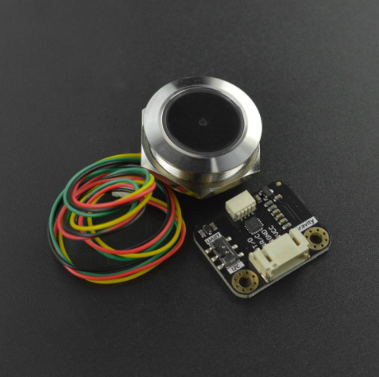

# DFRobot_LWNode
* [English Version](./README.md)<br>

LoRaWan  arduino 节点



## 产品链接（https://www.dfrobot.com)
    DFR1115：Gravity
	
## 目录
  - [概述](#概述)
  - [库安装](#库安装)
  - [方法](#方法)
  - [兼容性](#兼容性)
  - [版本](#版本)
  - [创作者](#创作者)

## 概述


提供一个Arduino库，控制DFR1115进行lora通信

## 库安装

要使用此库，首先下载库文件，将其粘贴到 \Arduino\libraries 目录中，然后打开示例文件夹并运行其中的演示程序。

## 方法
```C++
  /**
   * @fn setRegion
   * @brief 设置 LoRaWAN 区域。
   * @param region 区域枚举值
   * @return 如果成功则返回 true，否则返回 false
   */
  bool setRegion(eRegion_t region);
  
  /**
   * @fn setFreq
   * @brief 设置频率。
   * @param freq 频率值
   * @return 如果成功则返回 true，否则返回 false
   */
  bool setFreq(uint32_t freq);
  
  /**
   * @fn setBW
   * @brief 设置带宽。
   * @param bw 带宽值
   * @return 如果成功则返回 true，否则返回 false
   */
  bool setBW(uint32_t bw);
  
  /**
   * @fn setSF
   * @brief 设置扩频因子。
   * @param sf 扩频因子值
   * @return 如果成功则返回 true，否则返回 false
   */
  bool setSF(uint8_t sf);
  
  /**
   * @fn setRxCB
   * @brief 设置接收回调函数。当网关向节点发送数据时会调用此函数。
   * @param callback 回调函数指针
   */
  void setRxCB(rxCB *callback);
  
  /**
   * @fn setRxCB
   * @brief 为特定情况设置接收回调函数。
   * @param callback 回调函数指针
   */
  void setRxCB(rxCB3 *callback);
  
  /**
   * @fn setAppEUI
   * @brief 设置应用 EUI。
   * @param appeui 应用 EUI
   * @return 如果成功则返回 true，否则返回 false
   */
  bool setAppEUI(const char *appeui);
  
  /**
   * @fn setAppKEY
   * @brief 设置应用密钥。
   * @param appkey 应用密钥
   * @return 如果成功则返回 true，否则返回 false
   */
  bool setAppKEY(const char *appkey);
  
  /**
   * @fn setDevType
   * @brief 设置设备类型。
   * @param classType 设备类别枚举值
   * @return 如果成功则返回 true，否则返回 false
   */
  bool setDevType(eDeviceClass_t classType);
  
  /**
   * @fn setDataRate
   * @brief 设置数据速率。
   * @param dataRate 数据速率枚举值
   * @return 如果成功则返回 true，否则返回 false
   */
  bool setDataRate(eDataRate_t dataRate);
  
  /**
   * @fn setEIRP
   * @brief 设置发射功率。
   * @param EIRP 发射功率值
   * @return 如果成功则返回 true，否则返回 false
   */
  bool setEIRP(uint8_t EIRP);
  
  /**
   * @fn setSubBand
   * @brief 设置子频段。
   * @param subBand 子频段值
   * @return 如果成功则返回 true，否则返回 false
   */
  bool setSubBand(uint8_t subBand);
  
  /**
   * @fn enableADR
   * @brief 启用或禁用自适应数据速率（ADR）。
   * @param adr 如果为 true，则启用 ADR；如果为 false，则禁用 ADR
   * @return 如果成功则返回 true，否则返回 false
   */
  bool enableADR(bool adr);
  
  /**
   * @fn setDevAddr
   * @brief 设置设备地址。
   * @param devAddr 设备地址
   * @return 如果成功则返回 true，否则返回 false
   */
  bool setDevAddr(const uint32_t devAddr);
  
  /**
   * @fn setAppSKey
   * @brief 设置应用会话密钥。
   * @param appSKey 应用会话密钥
   * @return 如果成功则返回 true，否则返回 false
   */
  bool setAppSKey(const char *appSKey);
  
  /**
   * @fn setNwkSKey
   * @brief 设置网络会话密钥。
   * @param nwkSKey 网络会话密钥
   * @return 如果成功则返回 true，否则返回 false
   */
  bool setNwkSKey(const char *nwkSKey);
  
  /**
   * @fn join
   * @brief 启动 LoRaWAN 加入过程。设备将自动尝试加入网络。
   * @return 如果成功启动则返回 true，否则返回 false
   */
  bool join();
  
  /**
   * @fn start
   * @brief 启动设备操作。
   * @return 如果成功则返回 true，否则返回 false
   */
  bool start();
  
  /**
   * @fn setLoRaAddr
   * @brief 设置 LoRa 地址。
   * @param addr LoRa 地址
   * @return 如果成功则返回 true，否则返回 false
   */
  bool setLoRaAddr(uint8_t addr);
  
  /**
   * @fn isJoined
   * @brief 检查设备是否已经加入网络。
   * @return 如果已加入则返回 true，否则返回 false
   */
  bool isJoined();
  
  /**
   * @fn sendPacket
   * @brief 发送数据包。
   * @param v 要发送的值
   * @return 如果成功则返回 true，否则返回 false
   */
  bool sendPacket(double v);
  bool sendPacket(int32_t v);
  bool sendPacket(uint32_t v);
  bool sendPacket(void *buffer, uint8_t size);
  
  /**
   * @fn sendPacket
   * @brief 向特定地址发送数据包。
   * @param addr 目标地址
   * @param v 要发送的值
   * @return 如果成功则返回 true，否则返回 false
   */
  bool sendPacket(uint8_t addr, double v);
  bool sendPacket(uint8_t addr, int32_t v);
  bool sendPacket(uint8_t addr, uint32_t v);
  bool sendPacket(uint8_t addr, void *buffer, uint8_t size);
  
  /**
   * @fn sendPacket
   * @brief 发送字符串数据包。
   * @param data 要发送的字符串数据
   * @return 如果成功则返回 true，否则返回 false
   */
  bool sendPacket(String data);
    
  /**
   * @fn sendPacket
   * @brief 向特定地址发送字符串数据包。
   * @param addr 目标地址
   * @param data 要发送的字符串数据
   * @return 如果成功则返回 true，否则返回 false
   */
  bool sendPacket(uint8_t addr, String data);
  
  /**
   * @fn sendATCmd
   * @brief 发送通用 AT 命令。
   * @param cmd 预格式化的 AT 命令，不包含 \r\n
   * @return AT 命令的响应
   */
  String sendATCmd(String cmd);
  
  /**
   * @fn sendATCmdTest
   * @brief 发送测试 AT 命令。
   * @param cmd 测试 AT 命令
   * @return 测试 AT 命令的响应
   */
  String sendATCmdTest(char *cmd);
  
  /**
   * @fn setPacketType
   * @brief 设置数据包类型。
   * @param type 数据包类型（CONFIRMED_PACKET 或 UNCONFIRMED_PACKET）
   * @return 如果成功则返回 true，否则返回 false
   */
  bool setPacketType(ePacketType_t type = UNCONFIRMED_PACKET);
  
  /**
   * @fn getDevEUI
   * @brief 获取设备 EUI。
   * @return 设备 EUI 字符串
   */
  String getDevEUI();
  
  /**
   * @fn getNetID
   * @brief 获取网络 ID。
   * @return 3 字节网络 ID 信息
   */
  uint32_t getNetID();
  
  /**
   * @fn getDevAddr
   * @brief 获取设备地址。在 OTAA 模式下，此地址由网关分配。
   * @return 4 字节设备地址信息
   */
  uint32_t getDevAddr();
  
  /**
   * @fn getDataRate
   * @brief 获取当前数据速率。
   * @return 当前数据速率
   */
  uint8_t getDataRate();
  
  /**
   * @fn getEIRP
   * @brief 获取当前发射功率。
   * @return 当前发射功率
   */
  uint8_t getEIRP();
  
  /**
   * @fn getRSSI
   * @brief 获取接收信号强度指示（RSSI）。
   * @return RSSI 值
   */
  int16_t getRSSI();
  
  /**
   * @fn getSNR
   * @brief 获取信噪比（SNR）。
   * @return SNR 值
   */
  int8_t getSNR();
  
  /**
   * @fn atTest
   * @brief 执行 AT 测试命令。
   * @return 测试命令的结果
   */
  bool atTest();

```

## 兼容性

MCU                | Work Well    | Work Wrong   | Untested    | Remarks
------------------ | :----------: | :----------: | :---------: | -----
Arduino Leonardo|      √       |              |             | 
Arduino uno|      √       |              |             | 
Arduino MEGA2560|      √       |              |             | 
FireBeetle-ESP32|      √       |              |             | 
Microbit|      √       |              |             | 

## 版本

- 2024/07/02 - 版本 1.0.0 发布

## 创作者

Written by fengli(li.feng@dfrobot.com), 2024.7.2 (Welcome to our [website](https://www.dfrobot.com/))


